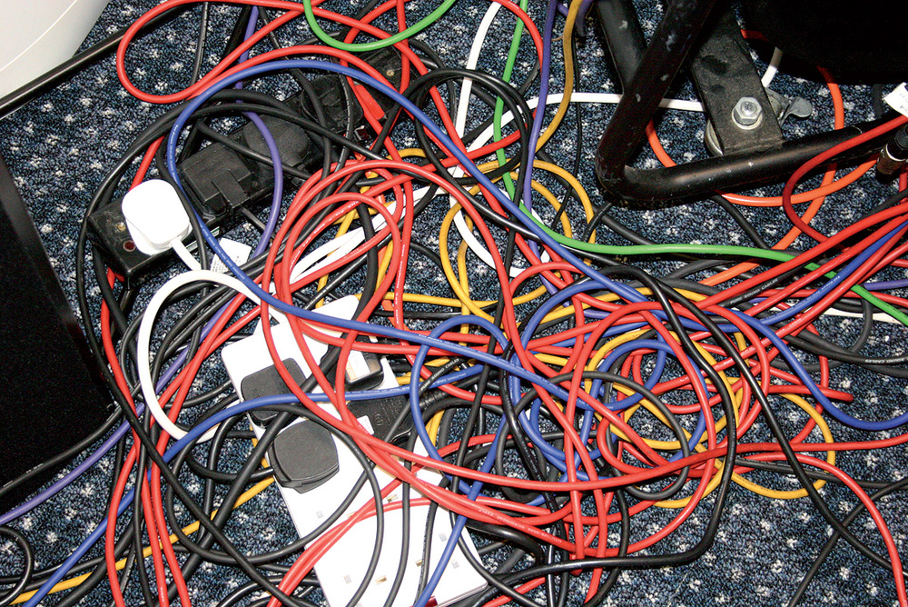

# Debugging



---

## The Flow of Information

When you're debugging something consider how actions flow through your page:

1. A user fills out a form and presses submit
2. The form has a submit listener attached to it which runs
3. The form should hae a `preventDefault()` to stop the page from refreshing
4. The event listener should get access to the input elements
5. The event listener should get `.value` off input elements
6. The event listener should make a network request
  * The network request should have the proper URL
  * The network request should have the proper method (GET, POST, etc.)
7. The response comes back
8. The response is parsed (usually as JSON)
9. Data is picked out of the response
10. Manipulate the DOM with the data

---

## Now What Can Go Wrong?

There were at least ten things in the list about the flow of information.

When something goes wrong you need to "run the ropes" and follow the flow of
information to find out exactly where things go wrong.

Start at the beginning of whatever initiates your action and inspect it at each
step along the way.

Use `console.log` statements, the `debugger` keyword, and try rendering
intermediate information on the page to prove to yourself that things are
working.

---

## Querying Page Elements

* document.getElementById
* document.getElementsByClassName
* document.getElementsByTagName

Remember that you can use these functions from one element to narrow your search

* myDiv = document.getElementById('my-div')
* myDiv.getElementsByClassName
* myDiv.getElementsByTagName

---

## Manipulating the DOM

* `document.createElement`
* `el.textContent`
* `parent.appendChild`

Removing one element:

* `el.remove()`

Removing all elements in a list:

```
let parent = documnent.getElementById('list')
while (parent.firstChild) {
  parent.firstChild.remove()
}
```

---
## fetch() Requests

GET requests:

* Make sure you get the URL correct
* Make sure conver the response to `.json()`
* Make sure you use promises properly

---
## fetch() Requests

POST requests:

* Use an object to configure the request

```js
config = {
  method: 'POST',
  headers: {
    'Content-Type': 'application/json',
    Accept: 'application/json',
    body: JSON.stringify({
      city: 'Seattle',
      population: 724745
    })
  }
}

fetch(URL, config)
.then(res => res.json()
.then(data => doStuff(data))
```

