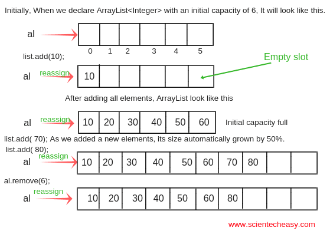
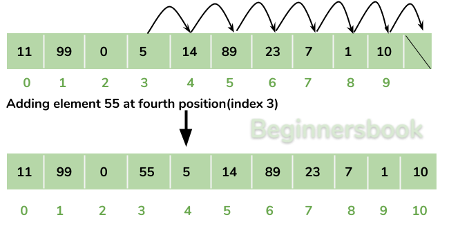
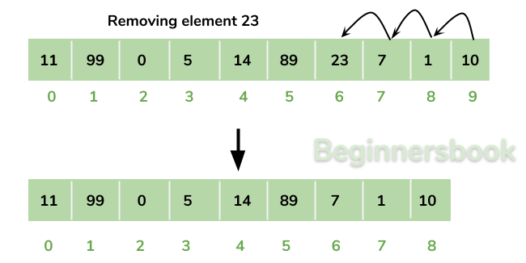

# Big-O Notation and Array Lists

* Explain the difference between rigid `Arrays` and squishy `Lists`
* Give examples of common O(N) `Array` operations
* Give examples of common O(1) `List` operations
* Give examples of common O(N) `List` operations

---

## Arrays vs Lists
This lecture makes a distinction between and `Array` and a `List`. Most of what
we have called an "array" in Ruby and JavaScript is actually more list-like.

A proper `Array` has the following properties:

* It is created once with one initial size and its size never changes.
* It only supports these two operations:
  * Get: `x = a[i]`
  * Set: `a[i] = 42`

A proper `Array` does not have these common operations that we're used to.
Instead, now we will consider these as things that make up a `List`:

---

## Arrays vs Lists

Lists are built out of arrays.

The `Array` is the more fundamental data structure. A `List` is built out of an
array. Today we will learn how to take a rigid, always-same-size, never-changing
`Array` and use it to build a quishy `List` that appears to have its size change
all the time by adding and removing elements from anywhere we want.

* A `List` is created "empty" and its size appears to grow and shrink over time.
* A `List` can `get(i)` or `set(index, value)` indexes and values.
* A `List` can add elements in the front, anywhere in the middle or the end.
* A `List` can remove elements in the front, anywhere in the middle or the end.


---

## Building a List of out an Array



---

## Rearranging to Add



---

## Rearranging to Remove



---

## Code: constructor

* Initialize an array with a specific size.
* Manually set everything in the array to `null` to show intentionality.
* Initialize a variable `size` to keep track of how much of the internal
  array is being used.

```js
class ArrayList extends List {
  constructor(capacity=7) {
    this.data = new Array(capacity)
    this.size = 0

    // specifically nullify all the values to start
    for (let i = 0; i < this.data.length; i++) {
      this.data[i] = null
    }
  }
}
```

---

## Code: append()

* Add an element at the end of the array
* Look at `size` to see where the last empty spot is.
* Add the value at that spot.
* Increment size to keep track of how much is being used.

```js
append(val) {
  this.data[this.size] = val
  this.size++
}
```

---

## Code: insertAtIndex()

If we want to insert something in the middle of the list we have to
scoot everything else back one index to make room for the new element.

```js
insertAtIndex(index, value) {
  this._checkCapacity()

  for (let i = this.size; i > index; i--) {
    this.data[i] = this.data[i - 1]
  }

  this.data[index] = value
  this.size++
}
```

---

## Code: removeAtIndex()

When we want to remove something we have to scoot everything toward the front
of the array to fill the gap that the thing just left.

```js
removeAtIndex(index) {
  let result = this.get(index)
  for (let i = index; i < this.size - 1; i++) {
    // scoot each value one to the left
    this.data[i] = this.data[i + 1]
  }

  this.data[this.size - 1] = null
  this.size--

  return result
}
```
---

## Code: toString

We can create our own `toString()` method to customize how this data
structure appears to the outside world.

Notice that even though the internal array has room for `7` things
(by default) our custom `toString()` method utilizes the `size`
property to only print out the portion of the array actually being used.

```js
toString() {
  let result = '['
  for (let i = 0; i < this.size; i++) {
    result += this.data[i] + ', '
  }
  return result + ']'
}
```
---

## Code: _grow()

* These two methods check to see if the internal array is full.
* When the internal array is full we create a new array twice the
  size of the old array, then copy all the values over.
* This makes it look like we can add elements to the list forever.

```js
_checkCapacity() {
  if (this.size === this.data.length) {
    this._grow()
  }
}

_grow() {
  console.log('growing from', this.size, 'to', this.size * 2)
  let newArray = new Array(this.size * 2)
  for (let i = 0; i < this.size; i++) {
    newArray[i] = this.data[i]                                      
  }
  this.data = newArray
}
```

---

## Big-O
As we build a `List` out of an `Array` we will add functionality method by
method. We will find out some functionality is more efficient than other
functionality. Big-O is a notation we can use to compare how different
operations perform efficiently compared to how many items are in our
`Array` or `List`.

---

## O(1) Constant Time
This operations takes the same amount of time now atter how many items are in
our data structure.

If you send a moving truck from LA to New York it's going to take a few days
no matter if the truck is totally empty or if it's packed totally full.

If you greet a convention of people by saying "Hello!" and waving then it will
take you a short amount of time no matter if the convention is empty or full.

---

## O(N) Linear Time
If you greet a convention of people by shaking everyone's hand one-by-one it will
take more time the more people that are there. It will take `N` more time.

* If there are 10 people there you must shake 10 hands.
* If there are 50 people there you must shake 50 hands.
* If there are 1,000 people there you must shake each of their 1,000 hands.

Algorithms that run in `O(N)` time take longer to run the more things there
are in your data structure.

---

## O(N^2) Quadratic Time
If everyone in a convention wants to meet each other each person must shake each
other person's hand.

If there are `100` people each person has to shake `99` other peoples hands.
That's basically `100 * 99 = 9,900` handshakes. (In reality there's about half
as many as that because each handshake involves two people).

In fact when we use Big-O we don't care about numbers like `N` people shaking
`N - 1` other people's hands and dividing that by one half and writing that like
`1/2 * O(N * N-1)`

Instead we just write `O(N^2)` and say "well that's way worse than just `O(N)`
linear time."

Writing the most simple form of `O(N^2)` is sufficient to convey how the procedure
grows exponentially more slowly the more people are present.

---

## O(N) vs O(N^2)

```js
search(arr, value) {
  for (let i = 0; i < arr.length; i++) {
    if (arr[i] === value) {
      return true
    }
  }
  return false
}
```


```js
containsDuplicates(arr) {
  for (let i = 0; i < arr.length; i++) {
    for (let j = i + 1; j < arr.length; j++) {
      // does the same thing occur in two different spots?
      if (i !== j && a[i] === a[j]) {
        return true
      }
    }
  }
  return false
}
```

---
## Big-O Is a Ballpark Estimate

* The only thing we care about is whether something is
  `O(1)`, `O(N)` or `O(N^2)`.
* We never write things like `O(3*N/7)`
* Knowing that an algorithm is `O(N)` and not `O(N^2)`
  is what we really care about.

* Big-O is a worst-case scenario measurement.
* If you make an improvement that makes your algorithm run twice
  as fast you don't write `O(N/2)`, you still say `O(N)`.

---

## Algorithm Rankings
* `O(1)`     - amazing constant time no matter how big `N` is!
* `O(N)`     - are ok, but there might be a better way to do things.
* `O(N^2)`   - may or may not have a better way to do things, but you should really definitely look!

---

## Other Rankings

These `O(log N)` and `O(N log N)` rankings also exist, and many more!
We will not discuss anything with `log` until later when we talk about
binary search, sorting algorithms and the Tree data structure.

* `O(log N)` - extremely performant. Better than `O(N)`.
* `O(N log N)` - are generally absolutely fantastic.
