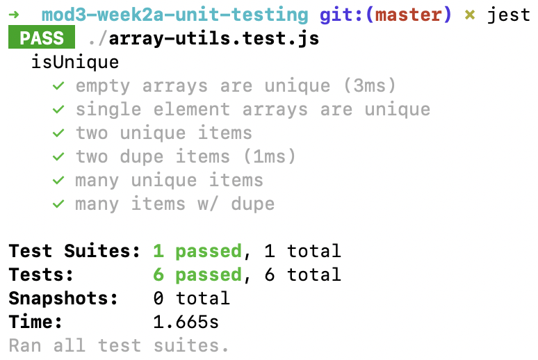

# Unit Testing



---
## What is Unit Testing?

* Unit tests are a way to test our code to make sure it behaves correctly.
* Unit tests execute our code and compare **expected** values to **actual**
  values.
* Unit tests are small tests that test specific edge cases of our code.
* Lots of small unit tests are created together to create an entire test suite
  that tests code thoroughly all together.
* We use unit tests on our own code to help ensure it's correct.

```js
describe('string capitalization', () => {
  it('should convert to lowerCase', () => {
    expect('Hello!'.toLowerCase()).toBe('hello!')
  })

  it('should convert to upperCase', () => {
    expect('Hello!'.toUpperCase()).toBe('HELLO!')
  })
})
```

---

## Install Jest

* There are many unit testing libraries out there.
* One popular Ruby library is [RSpec](https://rspec.info)
* The popular JavaScript library we will use is [Jest](https://jestjs.io)

Following instructions from [Jest: Getting Started](https://jestjs.io/docs/en/getting-started)

```bash
mkdir my-js-library
cd my-js-library
npm init
npm install --save-dev jest
```

Jest depends on the presence of a `package.json` file. Run `npm init` to
create one. You can use the `--yes` flag to use default values for all
its questions.

```bash
npm init -y
```

---

## A Simple Test
Create a file called `simple.test.js`. The `.test` extension is important.
Write a `describe()` function with several `it()` functions inside it.

Inside each function write code that tests **expected** values compared to
**actual** values using `expect(actual).toBe(expected)`.

Run the file by running `jest` in your terminal.

```js
describe('Some simple tests', () => {
  it('should add numbers', () => {
    let index = [0, 11, 22, 33, 44, 55].indexOf(22)
    expect(index).toBe(2)
  })

  it('should show you what a failure looks like', () => {
    let vegetables = ['asparagus', 'cucumber', 'ginger']
    let isFound = vegetables.includes('apple')
    expect(isFound).toBe(true)
  })
})
```

---

## Bank Account Class

Here's a class that represents a bank account. It has `deposit` and `withdraw`
methods. What would be good unit tests to write for this class?

```js
class Bank {
  constructor() {
    this.balance = 0
  }

  deposit(amount) {
    if (amount > 0) {
      this.balance += amount
    }
  }

  withdraw(amount) {
    if (amount <= this.balance) {
      this.balance -= amount
    }
  }
}
```

---

## Bank Account Test Cases

* Confirm the balance starts at zero when an account is created
* Confirm depositing money increments balance properly
* Confirm withdrawing money increments balance properly
* Confirm the balance doesn't change depositing negative money
* Confirm the balance doesn't change withdraw more than the balance

---

## Bank Account Unit Tests (1/2)

Make each test case a unit test!

```js
describe('Bank Account', () => {
  it('should have zero balance when created', () => {
    let account = new BankAccount()
    expect(account.balance).toBe(0)
  })

  it('deposit should increase balance', () => {
    let account = new BankAccount()
    expect(account.deposit(150)).toBe(150)
  })

  it('withdraw should decrease balance', () => {
    let account = new BankAccount()
    expect(account.deposit(150)).toBe(150)
    expect(account.withdraw(70)).toBe(80)
  })
})
```
---

## Bank Account Unit Tests (2/2)

Make sure to add tests for not just the "happy path." Add tests to make sure
the class is protecting itself against bad input, negative amounts in this
case.

```js
describe('Bank Account', () => {
  it('balance is unaffeceted by negative deposit amounts', () => {
    let account = new BankAccount()
    expect(account.deposit(150)).toBe(150)
    expect(account.deposit(-150)).toBe(150)
  })

  it('balance is unaffeceted by negative withdraw amounts', () => {
    let account = new BankAccount()
    expect(account.deposit(150)).toBe(150)
    expect(account.withdraw(-70)).toBe(150)
  })
})
```

---

## Testing Arrays

Consider creating a custom `.indexOf()` function for an array.
Let's say it accepts a **value** to search for and returns an
integer of the index where the value is found, or `-1` if the
item is not found.

These are common tests cases for any problem involving arrays:

* Test what happens with the size of the array
  * Run the algorithm on an empty array
  * Run the algorithm on a single-item array
  * Run the algorithm on an array with a few items in it
  * Run the algorithm on an array with many items in it
* Test what happens depending on if the thing is found or not
  * Searching for a value that is in the array
  * Searching for a value that is not in the array

Mix those two variations together to make sure the algorithm
works whether the thing you're looking for is or is not in
any size array.

Don't bother creating unit tests for absurd scenarios like,
"what if someone passed in `null` or a String?" Assume people
are using your function sanely.
