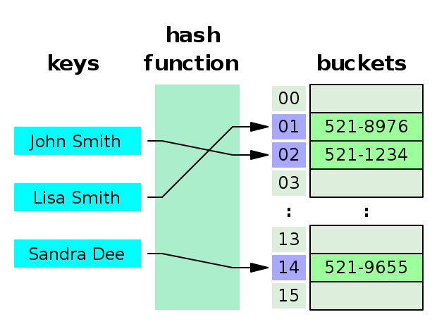

# Hash Tables



---
## Many Names

Hash Tables are known by many different names! Let's treat these all as
synonyms.

* Hash Tables
* Hash Maps
* Maps
* Dictionaries
* Objects (JavaScript)
* Hashes (Ruby)

---
## Valet Parking Analogy
* Imagine running a valet parking lot.
* Your job is to park cars when people arrive
* And to retrieve cars when people return

Let's consider different strategies for running an efficient valet lot.

---
## Old Strategy: Park In Order

### Parking Strategy
* Put the car in the first empty spot.
* The first car goes in spot 1
* The second car goes in spot 2
* The third car goes in spot 3
* If cars exit and leave gaps fill them as you park new cars

### Retrieval Strategy
* Search from spot 1 until you find the car to return

---
## Operations

Hash Tables store key/value pairs. Here's the common operations/methods
they have:

* **O(1)** `get(key)`
* **O(1)** `put(key, value)`
* **O(1)** `delete(key)`


They also should have other useful utility methods:

* `size()`
* `keys()`
* `values()`


---

# Sets

<center>
  
</center>

---
## Summary
* Sets keep track of elements in a group, without order or indexes.
* `set.has(item)` is much more efficient than an array.


* Sets have **O(1)** `.add()`
* Sets have **O(1)** `.has()`
* Sets have **O(1)** `.remove()`


---
## Sets in JavaScript
* **constructor([items])** `new Set()` or w/ optional items `new Set([1,2,3])`
* **.size** returns the number of items in the set


* **.add(value)`** add a value to the set.
* **.has(value)`** returns true/false if the value is in the set.
* **.delete(value)`** delete the value from the set.
* **.clear()`** delete all values from the set.


* **`.entries()`** returns an `Iterator` of each value in the set.
* **`.forEach(cb)`** calls the callback function for each value in the set.


```js
let burger = new Set(['bun', 'beef', 'lettuce', 'cheese', 'tomato'])
let salad = new Set(['lettuce', 'tomato', 'ranch'])

for (let item of burger) {
  if (salad.has(item)) {
    console.log('burger and salad both have:', item)
  }
}
```

---
## Operations: Union & Intersect

Sets as a concept (in math and in programming) have two operations:

**Union:** Take two sets and combine all items into one:

**Intersection:** Make a new set out of only items that appeared in both sets.

```txt
let s1 = new Set("It was a pleasure to burn".split(" "))
let s2 = new Set("It was love at first sight".split(" "))

let combined = union(s1, s2)
let intersection = intersect(s1, s2)

console.log('Union:', combined)
console.log('Intersection:', intersection)

// Union: Set { 'It', 'was', 'a', 'pleasure', 'to', 'burn', 'love', 'at', 'first', 'sight' }
// Intersection: Set { 'It', 'was' }
```

---
## Code: Union & Intersect

JavaScript has a very minimal `Set` implementation and you must define
`union` and `intersect` functions manually yourself.

```js
// add all items from both s1 and s2
function union(s1, s2) {
  let result = new Set()
  s1.forEach(item => result.add(item))
  s2.forEach(item => result.add(item))
  return result
}
```

```js
// only add the item if it occurs in s1 and s2
function intersect(s1, s2) {
  let result = new Set()
  s1.forEach(item => {
    if (s2.has(item)) {
      result.add(item)
    }
  })
  return result
}
```


---
## Uniqueness

* Sets only keep one copy of each item.
* If you add one item multiple times it will only appear once.


* Sets are not good at counting how many times an item appears in a group.
* Sets are good at knowing if something is part of a group.

```js
let set = new Set()
set.add(12)
set.add(99)
set.add(99)
set.add(99)
set.add(32)
set.add(52)
set.add(12)
set.add(12)

console.log(set)
```

```txt
Set { 12, 99, 32, 52 }
```

---
## Implementation

* Sets can be built by building a class around an internal Hash Map.
* The Hash Map provides the **O(1)** efficiency for add, remove, and has.

```js
class MySet {
  constructor() {
    this.hashMap = new HashMap()
  }

  add(value) {
    this.hashMap.put(value, value)
  }

  has(value) {
    return this.hashMap.get(value) !== undefined
  }

  remove() {
    this.hashMap.put(value, undefined)
  }
}
```


---
## Arrays vs Sets

* Finding something in an array takes **O(N)** time, or **O(log N)** time
  if the array is sorted.
* Arrays require searching through all their contents.


* Sets have a very fast **O(1)** `.container(value)` method.
* Sets are built out of hash maps.


* If you just care if someone is or is not in a group of things then you
  should prefer using a `Set` to an `Array`.
* If you need groups of things kept in a certain order then `Arrays`
  are an excellent choice.

---
## Problems

#### Good Set Problems
* What words do two books have in common?
* How many words do two books have in common?
* Take 100 books and create a collection of unique English words by combining
  all the words that appear in each book.
* Iterating through a graph with breadth/depth first traversal: is this
  current node in the set of nodes I have already seen?


#### Bad Set Problems
* How many times does a word occur in a book?
* What's the most frequent word in a book?

